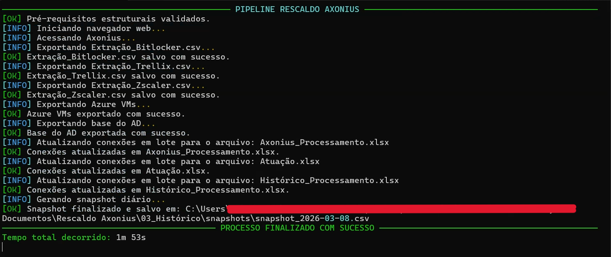

# Pipeline Rescaldo Axonius
> **Aviso Importante**: Este é um projeto de portfólio e demonstração técnica. O código real depende de redes internas corporativas e sistemas autenticados (Axonius, Azure, AD). Este script não pode ser executado "out-of-the-box" por usuários externos.

## 📌 Visão Geral
Este projeto é uma automação robusta de RPA (Robotic Process Automation) desenvolvida em Python. O objetivo central é orquestrar a extração de relatórios de ativos do portal **Axonius**, correlacionar esses dados com inventários de máquinas virtuais do **Azure** e realizar snapshots do **Active Directory (AD)**, consolidando tudo em painéis de atuação no **Excel**.

## 🚀 Como Funciona
A automação substitui o fluxo manual de auditoria de ativos, executando os seguintes passos:
1. **Navegação Automatizada (Playwright):** Diante da indisponibilidade de acessos diretos via API do Azure no ambiente, a solução utiliza o Playwright para navegar no portal, com perfil persistente para realizar o login via SSO nos portais Axonius/Azure e exportar os dados de máquinas virtuais de forma segura, desde que a sessão local esteja ativa. Isso demonstra a resiliência do projeto em entregar resultados mesmo com restrições de infraestrutura.

2. **Extração Dinâmica de Queries:** Navega pelas queries salvas no Axonius e realiza o download dos CSVs diretamente para a pasta de entrada de dados (00_Entrada_Dados/Axonius).

3. **Snapshot do Active Directory via PowerShell:** O Python orquestra a execução de scripts .ps1 que se comunicam com os Controladores de Domínio para extrair o status atual das máquinas (admaquina.csv).

4. **Processamento e ETL com Pandas:** Os dados brutos são limpos e transformados via Python, preparando as bases para a etapa de cruzamento.

5. **Orquestração de Power Query (Win32com):** O script dispara a atualização de conexões de dados dentro do Excel, permitindo que o Power Query realize o "merge" final entre Axonius, AD e Azure sem intervenção humana.

6. **Snapshot de Histórico:** Ao final, a ferramenta gera um registro temporal da base de atuação para fins de métricas e auditoria futura.

## 📸 Demonstração
Abaixo, um exemplo da execução do pipeline via terminal, utilizando a biblioteca **Rich** para fornecer feedback visual sobre o progresso de cada etapa:



## 🛠️ Tecnologias e Bibliotecas

- **Python 3**
- [Playwright](https://playwright.dev/python/) (Navegação automatizada via perfil persistente Edge/Chromium)
- [Pandas](https://pandas.pydata.org/) (Processamento de dados do snapshot diário)
- [python-dotenv](https://pypi.org/project/python-dotenv/) (Gerenciamento de variáveis de ambiente/secretos)
- [Rich](https://rich.readthedocs.io/) (Exibição customizada no terminal)
- [Win32com](https://pypi.org/project/pywin32/) / Power Query (Orquestração de instâncias locais do Excel e Power Query)
- **PowerShell** (Scripts externos e utilitários da pasta `execution`)

## 📁 Estrutura do Projeto

### Código Fonte

- `pipeline_rescaldo_axonius.py`: Script principal de orquestração do pipeline de relatórios.
- `execution/export_ad.ps1`: Script PowerShell responsável pelo intermédio entre o Python e as extrações via Active Directory.
- `.env.example`: Modelo do arquivo de variáveis que aponta para as URLs internas e de Queries Axonius.

### Estrutura de Diretórios de Dados (`BASE_DIR`)

O script assume que o diretório especificado na variável de ambiente `BASE_DIR` possui a seguinte organização para o armazenamento e a manipulação de informações:
```text
📁 BASE_DIR/
├── 00_Entrada_Dados/
│   ├── Axonius/                     # Extrações dinâmicas via Playwright
│   └── Bases/                       # CSVs brutos (admaquina.csv, vdis_azure.csv)
├── 01_Processamento/
│   └── Axonius_Processamento.xlsx   # ETL via Power Query
├── 02_Atuação/
│   └── Atuação.xlsx                 # Painel final para decisão técnica
└── 03_Histórico/
    ├── Histórico_Processamento.xlsx # Métricas consolidadas
    └── snapshots/                   # Histórico diário (snapshot_YYYY-MM-DD.csv)
```

> **Nota técnica:** A rotina começa aplicando a etapa de pré-requisitos (`validar_pre_requisitos()`), agindo em modo _fail-fast_ para checar se o `BASE_DIR` e os arquivos mestres descritos acima já existem. A ausência de qualquer estrutura essencial levanta um log descritivo antes de abortar o processo precocemente.

## ⚙️ Instalação e Requisitos
Embora o ambiente exija acessos corporativos, a estrutura segue o padrão:
1. Clone o repositório:
```bash
git clone https://github.com/hugopinaffo/pipeline-rescaldo-axonius.git
```

2. Instale as dependências:
```bash
pip install -r requirements.txt
```

3. Configure as variáveis de ambiente:
Duplique o .env.example para .env e preencha os caminhos de rede e IDs das queries.

## 🔒 Limitações e Contexto Educacional
Este repositório visa demonstrar competências em Engenharia de Dados e Automação de Processos. A execução depende de:
- Conectividade com o Resource Manager local do Azure.
- Acesso de leitura ao Active Directory corporativo.
- Permissões de exportação no portal Axonius.

## ⚖️ Licença
Este projeto está sob a licença MIT. Veja o arquivo [LICENSE](LICENSE) para mais detalhes.
